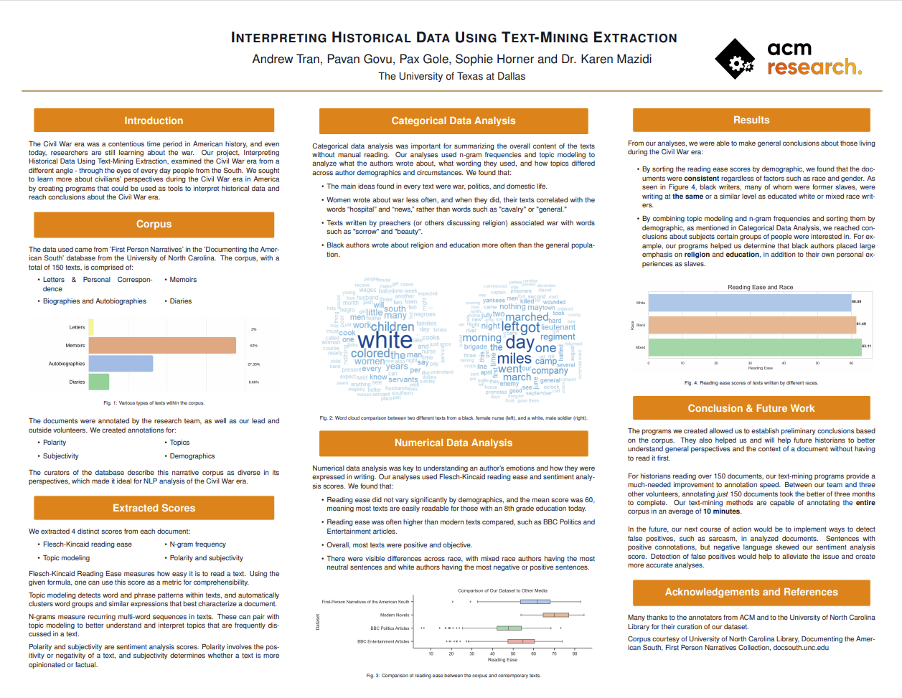

# Interpreting Historical Data Using Text-Mining Extraction

## Poster

## Purpose
The purpose of this project is to learn more about civilians’ perspectives during the Civil War era in America using methods of information retrieval and clustering alongside syntactical analysis and lexical semantics. Along with coming to historical conclusions, this project seeks to develop relevant and descriptive tools for historical text-mining and evaluate their efficacy for our particular data source.

## Data
The documents that we analyzed in this machine learning study came from a dataset called "First Person Narratives of the American South". This is essentially a collection of 150 different types of documents, including letters, memoirs, autobiographies/biographies, and diaries. The creators of this dataset, over at the University of North Carolina, intended for this to be a diverse collection of various authors and texts, optimized for Natural Language Processing (NLP) research. Another thing to note: all of the documents in the dataset are true. They are written by real people about real events. 

## Annotations Process
In most official, standardized machine learning studies, there is a set of data known as "gold standard" data, which is essentially a verified dataset that is widely considered true by the experts in a given field of study. It proves particularly useful in subjectivity classifications, in which you would use the gold standard dataset to compare it against the results that you generate in order to measure their accuracy. This gives the programmer an idea of how well or poorly their script/program is performing. However, in our case, we did not have any such gold standard dataset, as there really were no established results published on the dataset. As a result, we had to take matters into our own hand and create a gold standard dataset through a process of annotations. 

With the help of Bryant, Saksham, and Bryant, we first made an initial pass over all the document summaries, gathering basic preliminary information including the author's date of birth, the author's credentials, table of contents, subject headings, etc. Then, we went through all of the documents a second time with the intention of a more in-depth analysis. For every document, we were to provide a polarity score, a subjectivity score, a list of the primary topics, and demographics. 

- The polarity score was based on how positive or negative the document was. A score of 1 meant it was positive, a score of 0 meant neutral, and a score of -1 indicated a document with a negative tone.
- The subjectivity score was designed to measure the level of bias present in the text. A subjectivity score of 0 would be given to purely factual documents and a score of 1 to those documents that were more emotionally driven.
- The topics section encompassed a list of the main ideas we saw presented throughout the text. 
- Demographics included information about the author, such as their race, gender, economic status, religious affiliation, etc. By having at least four people perform annotations on each document, we reduced the chance of human error. 

In other words, if one annotator misinterprets a document, the likelihood of all the other annotators making the same mistake is low. Thereby, the integrity of the document annotation is preserved. Once all the scores were compiled, we could then compare the results that our scripts generated against the annotations that we had established to measure the program performance. 

## Methods

### Flesch Reading Ease
This script processes a directory of .txt files and uses the textstat library to calculate the Flesch Reading Ease score for each document. A separate script processes .csv files of the scores and generates a box plot. The other libraries and datasets used can be seen in the readme in the scripts subfolder.
### Topic Modelling
This script finds common and context relevant words and groups them into clusters to find topics within texts. A Latent Dirichlet Model (LDA) is used to map the words into the clusters. Output files include comparisons by gender, military affiliation, and impact of religion on text.
### N-Grams
This script finds recurring bi-grams (two word combinations) and tri-grams (three word combinations) within the text to find common ideas within the texts. The program keeps tally of the bi-grams and tri-grams then returns the most common and relevant ones.
### Sentiment Analysis
These scripts calculate the Polarity (Positive/Neutral/Negative attitude) and Subjectivity (Emotional-Factual content) within a text. The program calculates both scores and keeps track in a csv file. Graphs included are across demographics.

## Results
 - Black authors wrote about topics pertaining to improving living standards for African-Americans, such as education, religion, and family life.
 - Writing complexity was standard across different demographics including economic class, race, and gender
 - Our programs can process the entire dataset (150 documents) in ~10 minutes, vs. our manual annotation process which took ~3 months
## Conclusion
The programs we created allowed us to establish preliminary conclusions based on the corpus. They also helped us and will help future historians to better understand general perspectives and the context of a document without having to read it first. In the future, our next course of action would be to implement ways to detect false positives, such as sarcasm, in analyzed documents. Sentences with positive connotations, but negative language skewed our results. Detection of false positives would help to alleviate the issue and create more accurate analyses.
## Contributors

- [Sophie Horner](https://github.com/hornersc)
- [Andrew Tran](https://github.com/nartmobile)
- [Pavan Govu](https://github.com/pavangovu)
- [Pax Gole](https://github.com/paxgole)
- [Abby Thomas](https://github.com/thomasabigail) - Research Lead
- [Brian Nguyen](https://github.com/briannoogin) - Graduate Advisor
- [Dr. Karen Mazidi](https://github.com/kjmazidi) - Faculty Advisor
